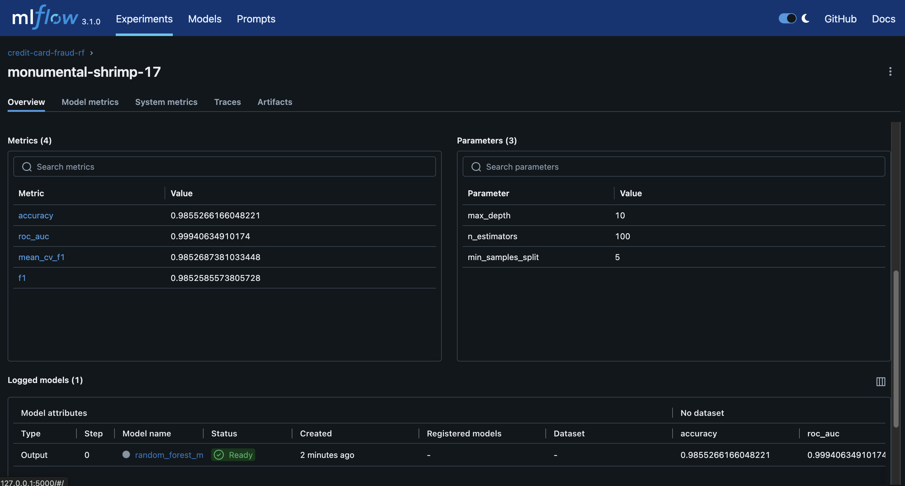
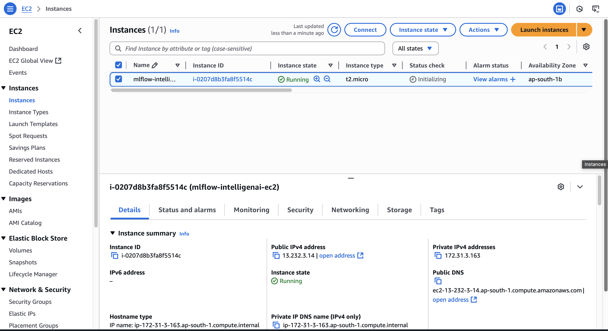
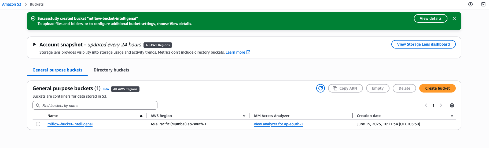

  # 🚨 Automated Fraud Detection Pipeline

This project builds an end-to-end pipeline for detecting fraudulent credit card transactions using machine learning. It features model training with **Random Forest**, performance tracking using **MLflow**, an **automated email alert system**, and deployment via **FastAPI + Docker** for real-time inference.







---

## 🔍 Features

* ✅ **Fraud Detection Model**
  Trained a Random Forest classifier (98% accuracy) to identify fraudulent transactions.

* 📊 **MLflow Integration**
  Tracks parameters, metrics, and artifacts, and enables automatic retraining on updated datasets.

* 📧 **Email Alert System**
  Sends instant email notifications to the compliance team when high-risk fraud is detected.

* ⚙️ **FastAPI + Docker Deployment**
  Serves predictions as a scalable REST API using FastAPI, containerized with Docker for portability.


## 🛆 Setup Instructions

### 1. Clone the repo

```bash
git clone https://github.com/your-username/automated-fraud-detection.git
cd automated-fraud-detection
```

### 2. Create environment and install dependencies

```bash
pip install -r requirements.txt
```

### 3. Set up `.env` file for email alerts

```
EMAIL_USER=your_email@example.com
EMAIL_PASS=your_password
RECIPIENT=recipient@example.com
```

### 4. Train the model with MLflow tracking

```bash
python train.py
# or run notebook: notebooks/model_training.ipynb
```

### 5. Start the FastAPI server

```bash
uvicorn app.main:app --reload
```

---

## 🐿️ Run with Docker

```bash
docker build -t fraud-detector .
docker run -p 8000:8000 fraud-detector
```

---

## 🧺 API Usage

### 🔎 Predict Fraud

```bash
POST /predict

Request Body:
{
  "V1": -1.3598,
  "V2": -0.0727,
  ...
  "V28": 0.1234,
  "Amount": 149.62
}

Response:
{
  "prediction": 1,
  "risk_score": 0.94
}
```

---

## 🧠 Model Performance

| Metric   | Value |
| -------- | ----- |
| Accuracy | 98%   |
| F1 Score | 0.985 |
| AUC-ROC  | 0.99  |

---

## 💪 Tech Stack

* **Languages**: Python
* **ML**: Scikit-learn, Pandas, Numpy
* **Tracking**: MLflow
* **Deployment**: FastAPI, Docker
* **Email**: smtplib, Pydantic
* **Version Control**: Git

---

## 📩 Alert System

When a prediction has a **risk score above 0.9**, an automated email is sent to the compliance team with transaction details, alerting them of possible fraud.

---

## 📊 MLflow UI

To view past experiment runs:

```bash
mlflow ui --port 5000
```

Visit: `http://127.0.0.1:5000`

---

## ✅ Future Improvements

* Use class imbalance techniques like SMOTE or ADASYN
* Incorporate time-series analysis for sequential fraud patterns
* Add CI/CD for automated retraining pipelines
